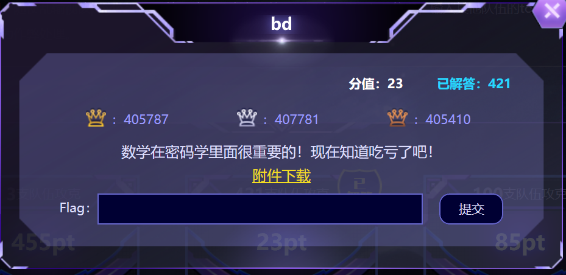
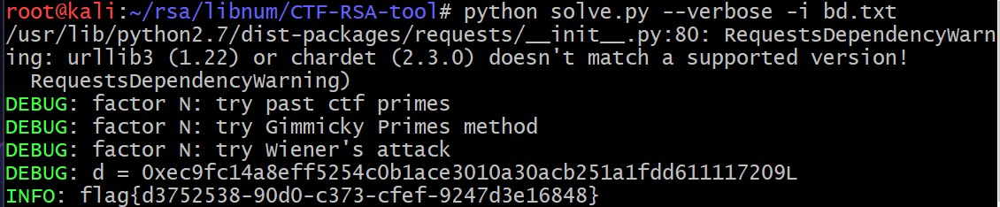

# 第十三届全国大学生信息安全竞赛

## Crypto
### bd
#### 题目

#### 题解
```
（Win10）
安装libnum
git clone https://github.com/hellman/libnum.git 
cd libnum 
python setup.py install
安装gmpy2
git clone https://github.com/D001UM3/CTF-RSA-tool.git 
cd CTF-RSA-tool 
pip install -r "requirements.txt"
```
  
#### FLAG
flag{d3752538-90d0-c373-cfef-9247d3e16848}  
#### 问题
1. Failed to build gmpy2  
解决：[GMPY2 Not installing, mpir.h not found](https://stackoverflow.com/questions/40075271/gmpy2-not-installing-mpir-h-not-found)
#### 参考
[CTF中RSA题型解题思路及技巧，附小白福利](https://www.freebuf.com/articles/others-articles/161475.html)  
[yafu安装](https://blog.csdn.net/weixin_41603028/article/details/97167312)  
[RSA模数相关攻击](https://nonuplebroken.com/2018/11/26/RSA模数相关攻击/#%E4%BE%8B%E5%AD%90-3)
