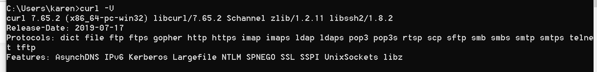

# Web
## Web前置技能
### HTTP协议
#### 请求方式
##### 题目

##### 题解
参考[win10配置curl](https://www.jianshu.com/p/cc9cf0e3966e)，看到配置成功页面

[curl 的用法指南-阮一峰的网络日志](http://www.ruanyifeng.com/blog/2019/09/curl-reference.html)根据题目提示更改Http请求，得到flag.  

#### 302跳转
##### 题目
##### 题解
#### Cookie
##### 题目
##### 题解
#### 基础认证
##### 题目
##### 题解
#### 响应包源代码
##### 题目
##### 题解