# 彩蛋

## 首页
### 题目

### 题解
显示首页查看元素发现什么都没有。  
[域名爆破](http://z.zcjun.com/)  
  
依次打开，而且可以看到目标网址的页面不一样，然后查看元素得到flag。  
* 由于先做的彩蛋，其实如果先做了别的题,用bp抓包多了，就会发现很明显就是'api.ctfhub.com'  
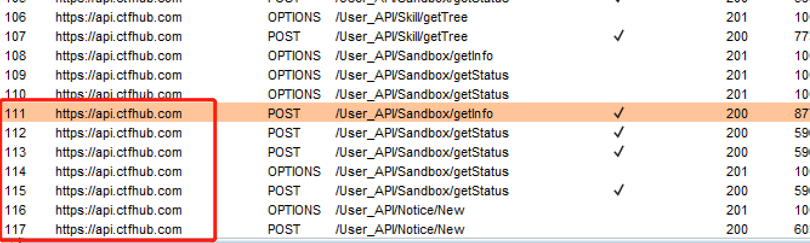

## 公众号
### 题目

### 题解
* 我还以为是一个特别的脑洞呢🤣

## 题目入口
### 题目
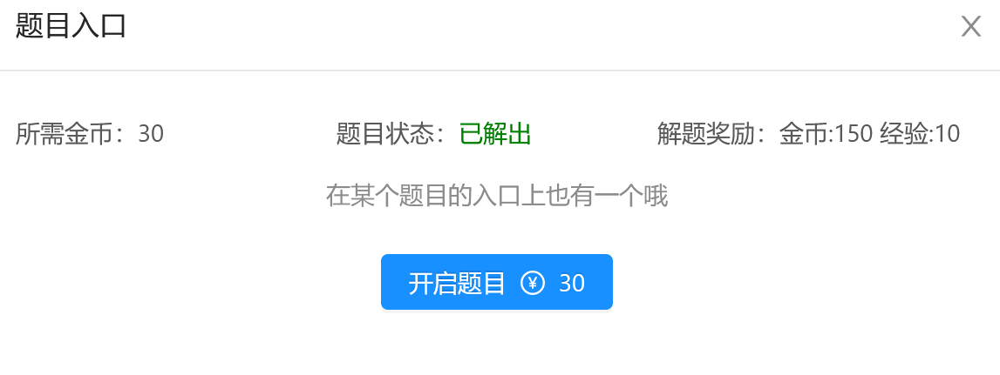
### 题解
* 分析：是在做web302的时候，一直没有跳转，忘了是点开网络提示刷新还是访问了index.php，然后就点击突然弹出了这个页面，然后检查元素看到了

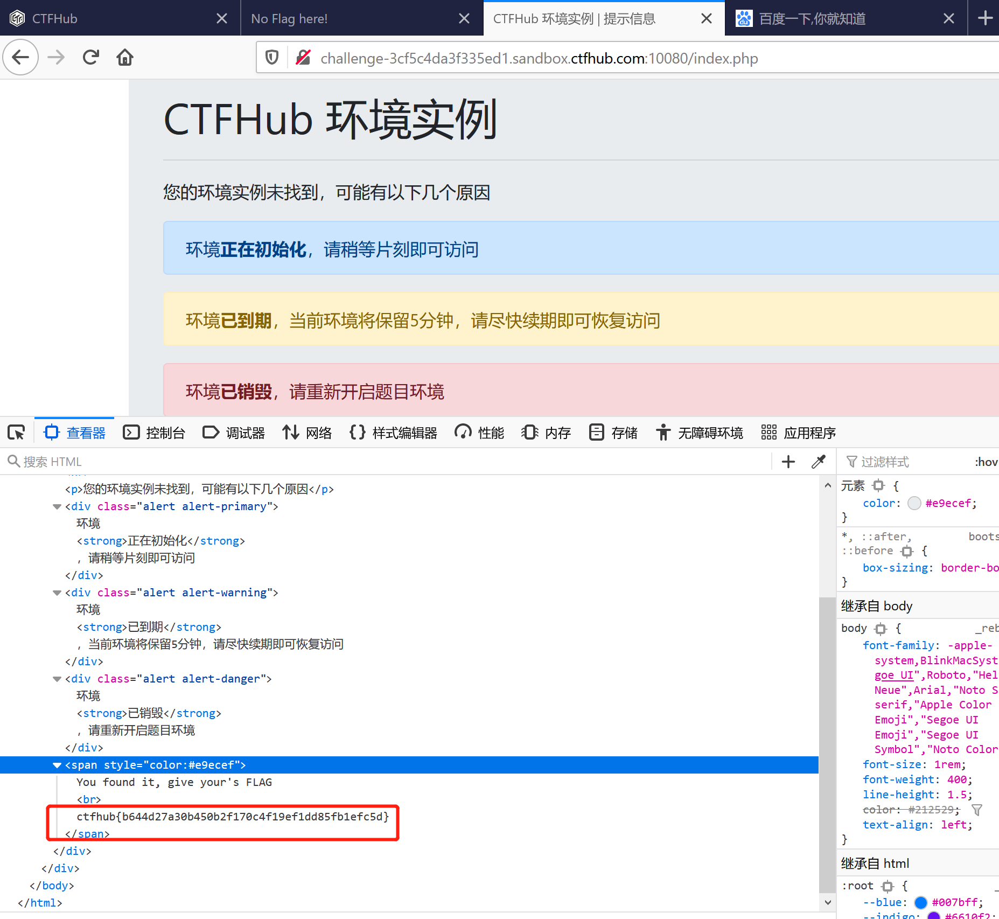
## Writeup
### 题目
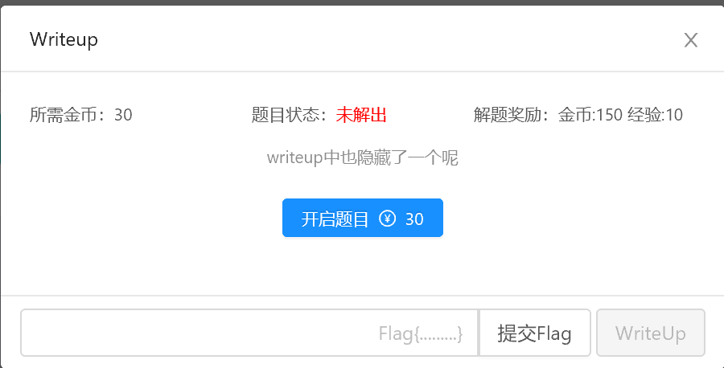
### 题解
去Writeup中寻找。
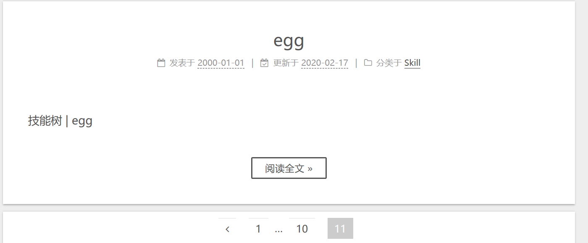  
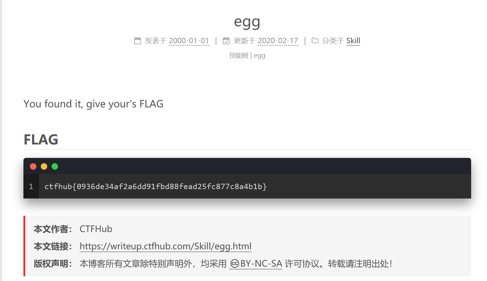  
## 工具
### 题目
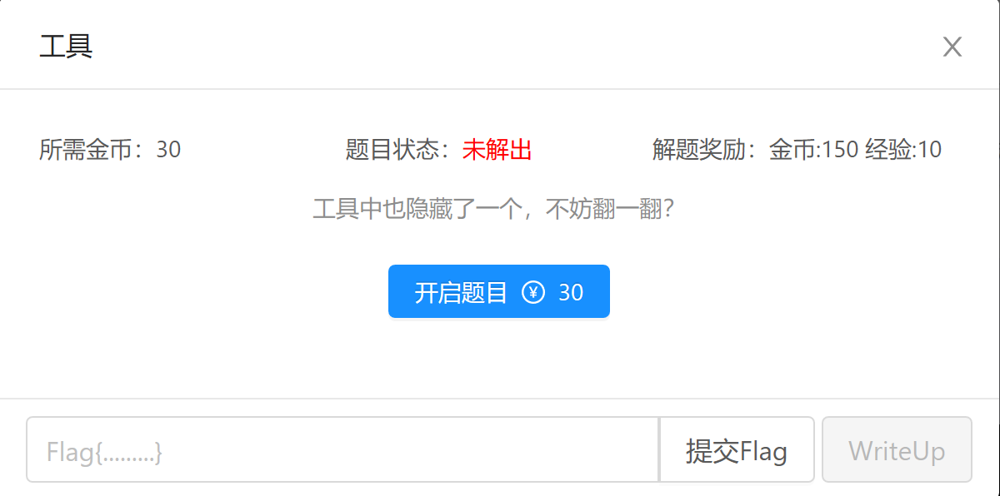
### 题解
* 分析：点击下载，弹出新网页显示404  
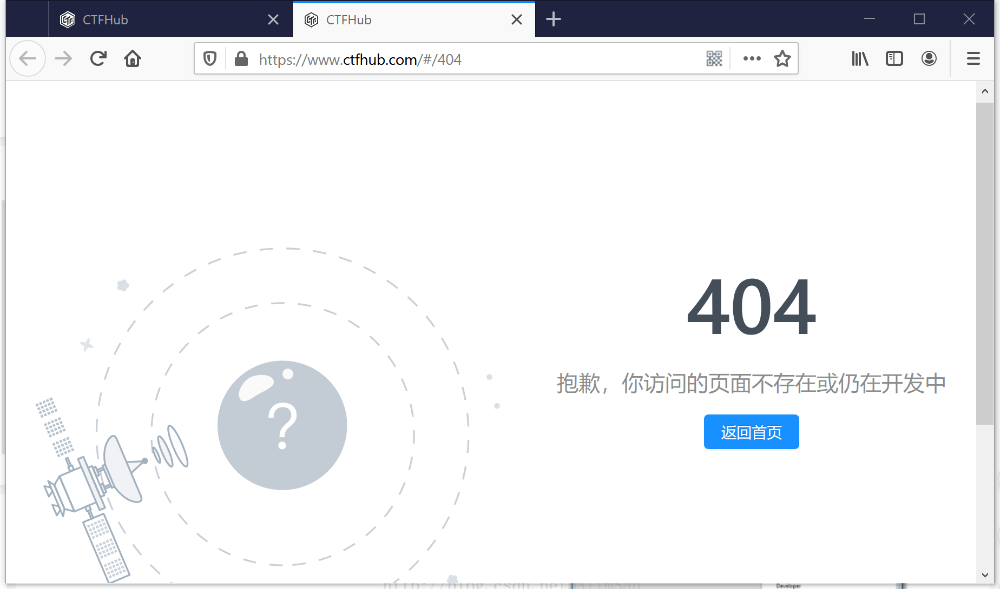  
以后看到Burpsuite状态200🧐 
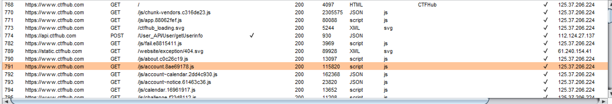  

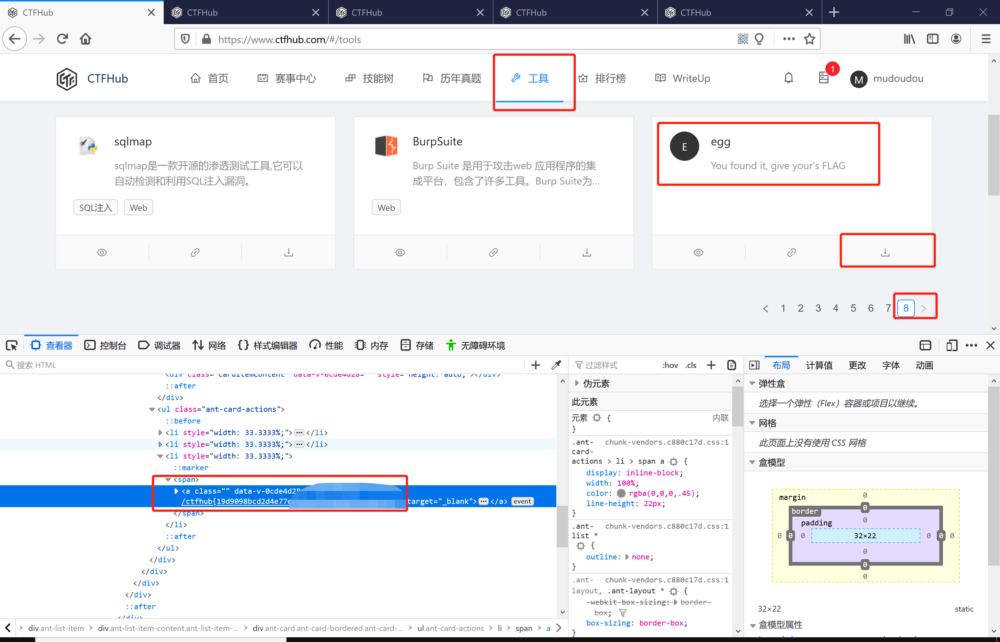
## 赛事
### 题目

### 题解
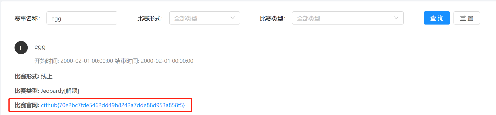
## 真题
### 题目
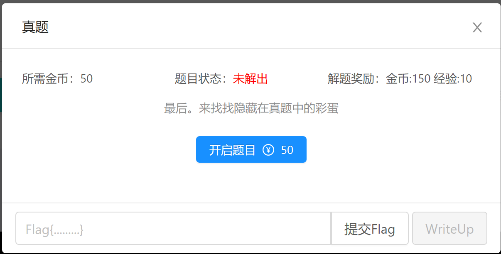
### 题解
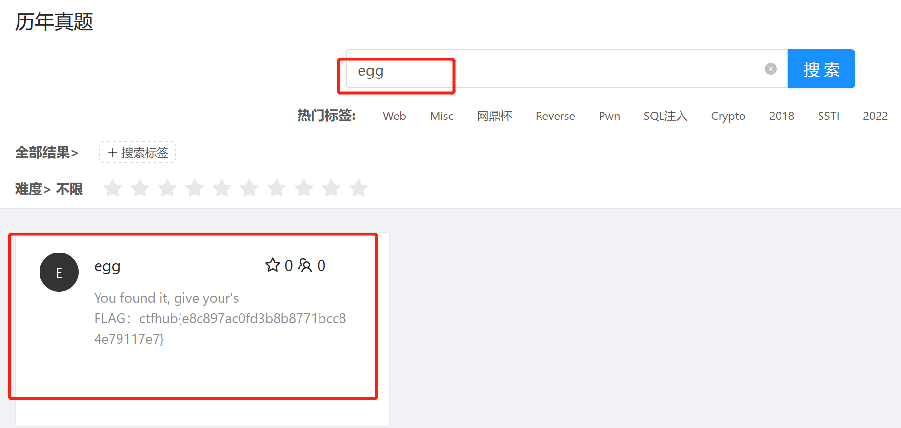
## 投稿提交
### 题目
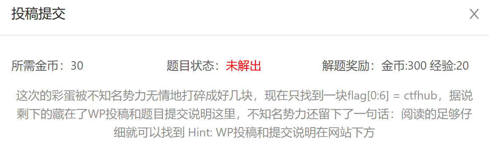
### 题解
* 思路：能看的都认真看，包括附件包括检察元素，能下载的都下载，图片就用图片的查看方法。

题目给出flag[0:6]="ctfhub"  
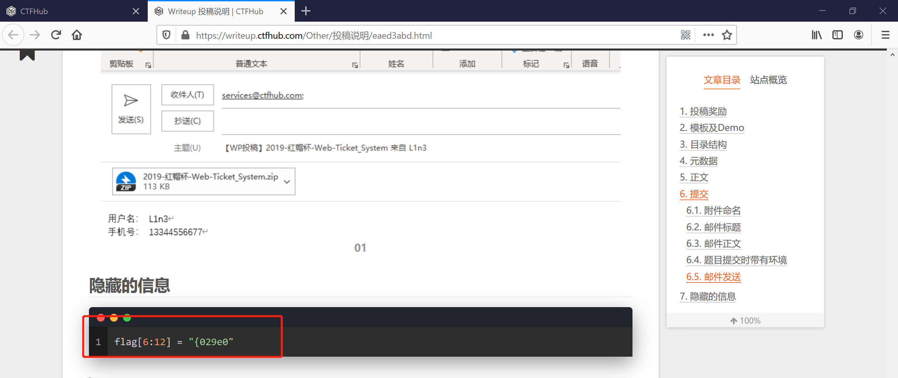  
flag[6:12] = "{029e0"
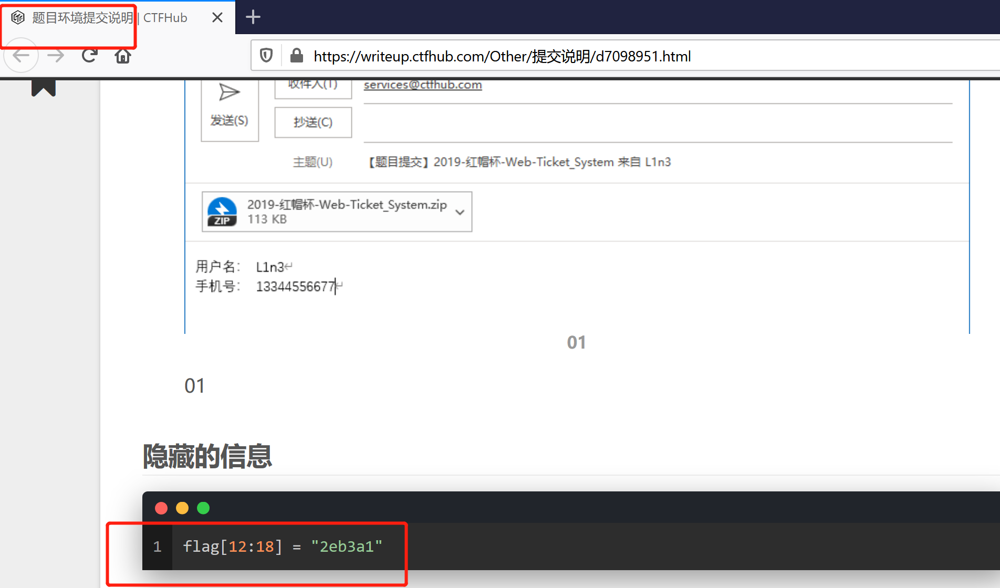 
flag[12:18] = "2eb3a1"
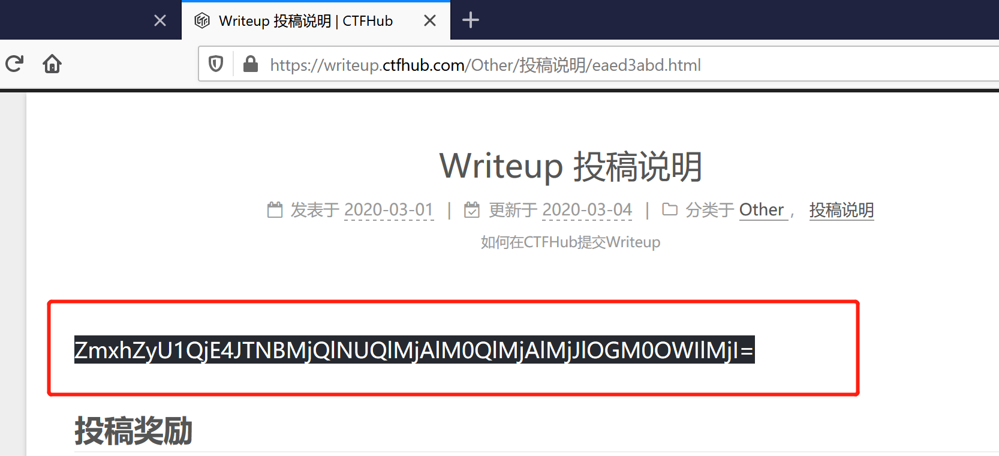  
* 我说为啥这里这么白一大块🤪 

ZmxhZyU1QjE4JTNBMjQlNUQlMjAlM0QlMjAlMjJlOGM0OWIlMjI=，[base64解密](https://base64.supfree.net/)，得到flag[18:24] = "e8c49b"  
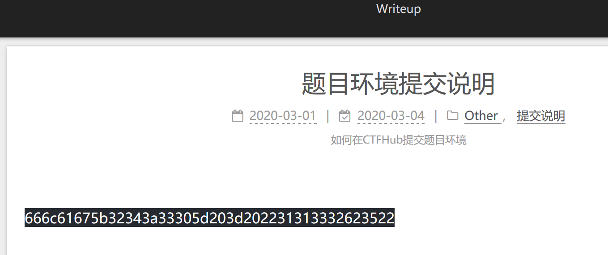  
666c61675b32343a33305d203d202231313332623522[hex解码](https://www.107000.com/T-Hex/)得到flag[24:30] = "1132b5".  
下载图片使用010editor.search中设置ascii，查找flag.  
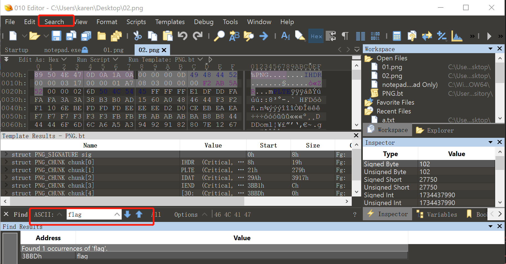  
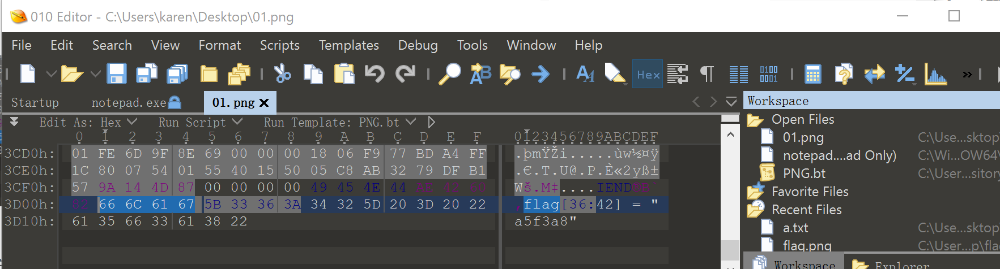
两个网页的图片分别得到flag[36:42] = "a5f3a8"和flag[30:36] = "15b652".   
下载附件，挨着看，找到egg_flag.txt文件。内容中明确告诉了我们加密方法，对于key先使用了key尝试，后来用了ctfhub就对了。  
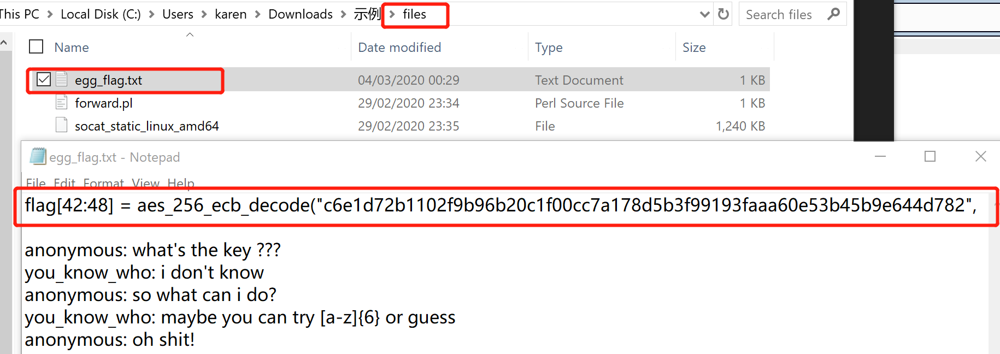   
[AES加解密](http://tool.chacuo.net/cryptaes)  
 
得到：62013}  

flag="ctfhub{029e02eb3a1e8c49b1132b515b652a5f3a862013}"
