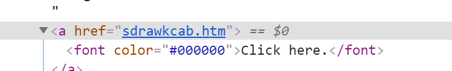
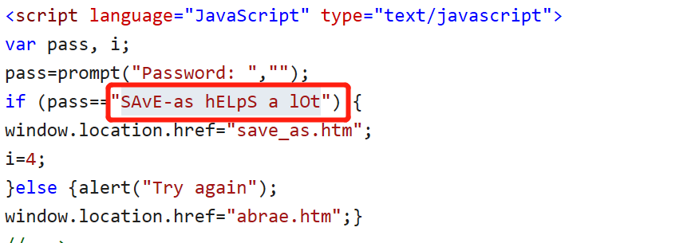

# 关于hack-test.com的游戏攻略
[hack-test.com---一个有意思的网站](http://www.hack-test.com/index.htm)
## Level 1
由javascript代码得到答案是:null

[第一次不知所措，有搜索](https://www.cnblogs.com/tk091/archive/2012/09/26/2703593.html)
## Level 2
弹出了一个窗口，填入password:l3l

## Level 3

## Level 4
做了好久，突然发现，之前都是在本关弹出弹框，而第四关的弹框是网页跳转，直接跳到第五关

## Level 5

## Level 6

## Level 7
这次不是在源代码中，找了很久

差点没找到

提交后

回到第七关，看到提示

明明输入正确，但是还是错为什么呢？我发现我的页面和别的小伙伴页面不一样，我之前用的IE和chrome浏览器，我自己也觉得为什么排版这么难看。然后看到IE和chrome的控制台都有报错。
[浏览器兼容](https://blog.csdn.net/weixin_30672019/article/details/96213889)

## Level 8
查看源代码

查看pwd2.php

根据提示访问'http://www.hackertest.net/images/phat.gif',右下角看到
  
提示找Photoshop文件,由于pdd和psd是photoshop特有的图像格式，访问"http://www.hackertest.net/images/phat.pdd"，404报错说明没有，'http://www.hackertest.net/images/phat.gif'，弹出弹窗，保存图片。
photoshop打开，删去图层，得到账号和密码。  

## Level 9
查看源代码，还是尝试访问'http://www.hackertest.net/images/phat.gif',发现是之前的页面，不知道怎么破。
但是level8没有下拉框，level9下拉，看到如下

因此base64 decode得到：'gazebruh'，并加在网页最后,加上'.php'，进入第十关。
## Level 10

看到多了一行字，而这些字长得和其他的有细微差别。

从源代码中得到：shackithalf，输入后发现网页加载就像是有问题，一开始还以为是网不好。

查看源代码

进入下一关
## Level 11
尝试images/try.gif，没有线索，上方显示如下，进入下一关。

## Level 12
线索

这一次只有一个图片

## Level 13
首页就给了提示

## Level 14

这一次图片没有水印，但是发现totally.php可能可以，尝试后通过
## Level 15 && Level 16
提示查看图片，但是打开是这样

另存为后打开  
  
notepad打开  

网页打开  
  
根据提示

还是无法正常打开，另存为，Notepad打开
  
不是单纯的曾经，以前是在主页后加xx.php,这一次排列组合'/unaviable'和'/images'和'Ducky.php'，得到'http://www.hackertest.net/unavailable/Ducky.php'
## Level 17
得到提示

打开cmd查看ip

发现Ip不一样,因为火狐有代理，以相同浏览器的为准。[内网ip和外网ip](https://blog.csdn.net/Alexwym/article/details/81772446)

提示回退上一层，输入网址  

## Level 18
尝试'images/n00b.gif'没有线索,在看代码，好像真的需要cookie，但是发现了线索，尝试成功

## Level 19

根据代码给的提示打开图片

## Level 20
给出提示,应该可以得到一个域名

base64 decode得到的结果再解码，最后出现  
  
访问'www.streetkorner.net/gb22332'不对,访问'http://www.hackertest.net/gb22332/'

HTTP版本不受支持,但是这个错误像是提前做好的错误  

想了好久看到提示说使用错误文件，访问'http://www.hackertest.net/gb22332/505'，状态404，不对,访问'http://www.hackertest.net/505'状态200，对了。

访问'http://www.hackertest.net/403',状态404.访问'http://www.hackertest.net/505/403'
  
好懵啊，一搜索，42？!,访问'http://www.hackertest.net/42.php' 
* 《银河系漫游指南》  
 
  
点击
