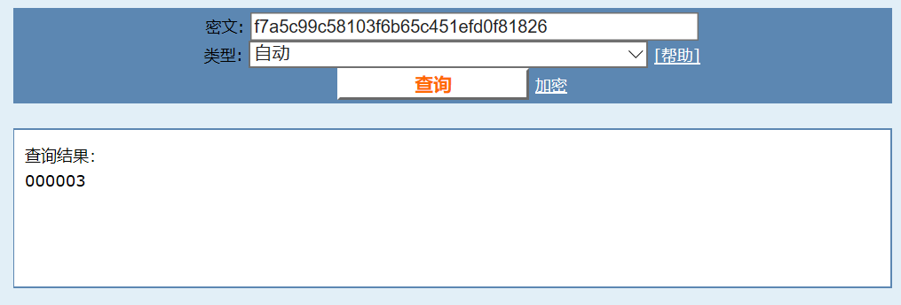
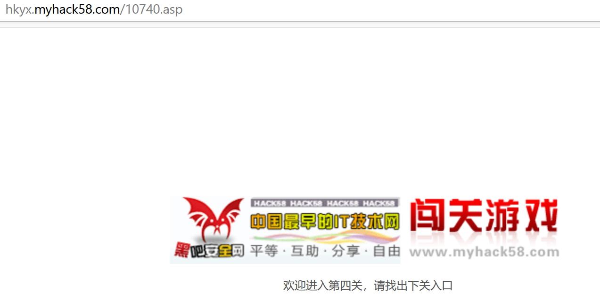

# [黑客丛林之旅](http://www.fj543.com/hack/)

## 第一关
提示图片有线索，先是保存图片，发现保存的只是一小块，再保存还是一小块，检查元素发现是一个表格，因此依次查找，点击每一个小块，找到了入口如下图所示。

## 第二关

提示MD5之谜，检察元素看到一长串数字，因此[在线MD5解密](https://cmd5.com/)，得到000003  
  
输入000003提交没反应，检查元素，又想到之前的页面是'http://hkyx.myhack58.com/b2.asp' ,'.asp'应该是每个页面的后缀，这感觉像大多数游戏~
 
因此网页输入'http://hkyx.myhack58.com/000003.asp',进入第三关。
## 第三关
 
下载密码锁  
* 这个就不会了，搜索了攻略原来需要黑客动画吧VIP客服的的qq：814360954，然后直接地址栏跳转‘http://hkyx.myhack58.com/814360954.asp’  

一闪而过~

bp抓包依次send to repeater，看到一堆计算公式,稍作修改，python里跑。

```
a = 2.0030315
b = a * 2
c = a + b
d = c / b + a
e = c - d * b + a
f = e + d /c -b * a
g = f * e - d + c * b + a
a = g * g
print(a)
```
  
得到10740.019730745451，根据源代码数字取整，因此下一个网页‘http://hkyx.myhack58.com/10740.asp’
## 第四关
  
看到一串奇怪的编码  
  
[unicode解码](https://www.sojson.com/unicode.html)  

## 第五关
  
这一次script中的编码解码得到的还是当前页面，但是在上一个<p>中看到出现了xxx.rar的提示，因此地址栏访问以后下载xxx.rar.   
     
解压看到提示   
   
输入3，再解压，进入下一关'/six6six.asp'
   
## 第六关
